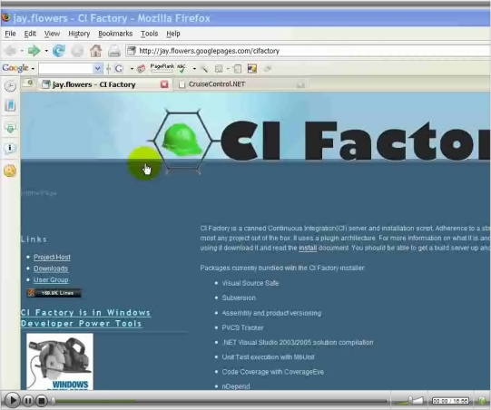

## CI Factory Beta 0.8.0.27

There is a new beta for [CI Factory](http://www.cifactory.org/), version 0.8.0.27. There are a lot of new features in this release. The changes are documented [here](http://docs.google.com/Doc?id=dd6cv3jm_09r2s2h). There are 22 new NAnt tasks, 13 new NAnt functions, 9 new CCNet plugins, and 10 new CI Factory Packages!

- Analytics – This experimental at the moment and is not fully integrated.
- Ant – For run Ant scripts, building Java.
- Backup – Will backup the CCNet state file, build log file and Artifact directory to as network share of your specification.
- CoverageEye – For code coverage during unit test execution.
- CSDiff – Provides visual diffs on the dashboard.
- Deployment – For publishing artifacts to the artifact folder and displaying links on the dashboard.
- DotNetUnitTest – Running unit tests with MbUnit, will run NUnit tests too.
- InstallShield – Build MSIs and InstallScript installers.
- LinesOfCode – Reports LOC on the dashboard.
- MSBuild – Will build a 2005 solution file.
- MSTest – Will run MSTests.
- NCover – Will run unit tests under NCover for code covereage stats, uses NCover Explorer too!
- nDepend – Provides OO metrics reports on the dashboard.
- Simian – Provides duplication stats on the dashboard.
- SourceModificationReport – Tracks changes to source code.
- Subversion – Interface to Subversion.
- TestCoverage – This experimental at the moment and is not fully integrated.
- Tracker – Associates source code changes to trackers, displays trackers on the dashboard.
- Versioning – Versions AssemblyInfo and ProjectInfo files.
- VisualSourceSafe – Interface to Visual Source Safe.
- VS.NETCompile – Will build a 2005 or 2003 solution with devenv.exe.
- VSTSVersionControl – Interface to Visual Studio Team Systems Version Control, note the installer is not complete just yet. You will need to configure the CCNet project yourself. Otherwise it is complete.

So far the 0.8 release has racked up 234 commits.

### Codebase History

Some the coolest new features are in the setup. It can setup your new CI Factory project, load it into the source control repository, configure IIS, start CCNet, and open the Build Script Solution. But don’t take my word for it look at this [screencast](http://jayflowers.com/CI%20Factory/Videos/CI%20Factory%20Beta%200.8/CI%20Factory%20Beta%200.8.html).

[](http://jayflowers.com/CI%20Factory/Videos/CI%20Factory%20Beta%200.8/CI%20Factory%20Beta%200.8.html)

You can download the bits from [here](http://code.google.com/p/ci-factory/downloads/detail?name=CI-Factory-Beta-0.8.0.27.zip&can=2&q=).


```batch
If you are going to use the Ant package please note that I could not include the Java distro for size reasons. You will need to plop the jre in the Ant Packages Java folder or configure the package to look in a different location.
```
