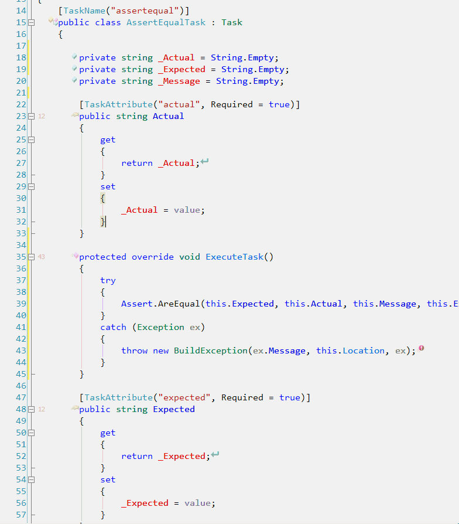
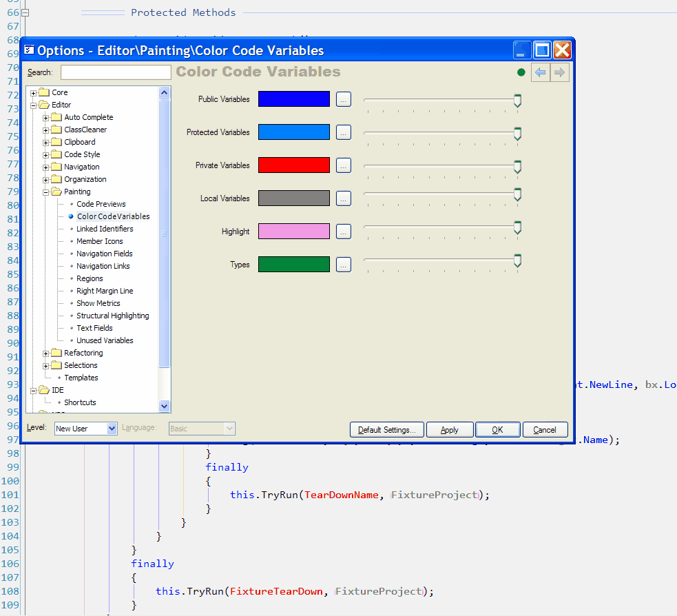
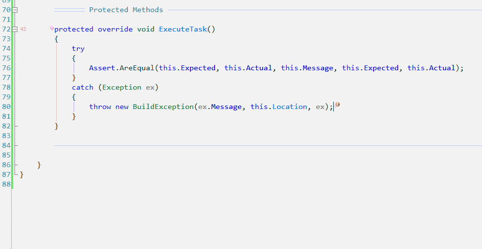
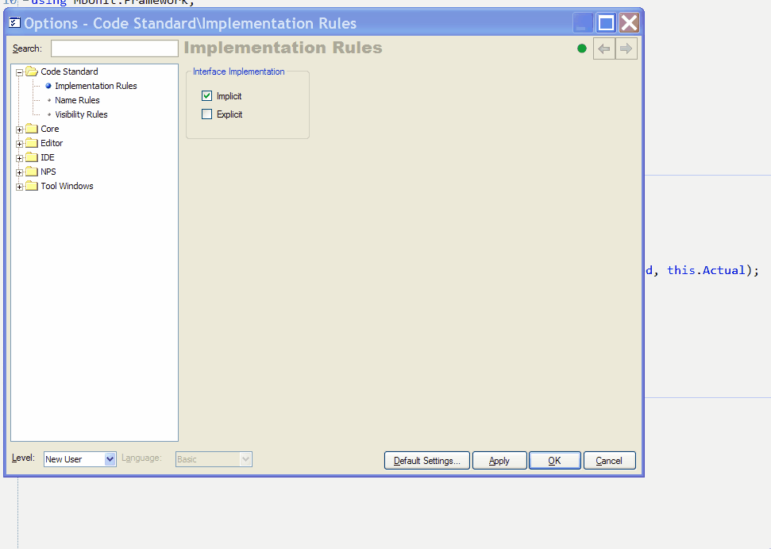

## My Favorite DXCore Plugins

Here are a few of my favorite [DXCore](https://www.devexpress.com/Downloads/NET/IDETools/DXCore/Index.xml) plugins.

In a [recent post](http://jayflowers.com/WordPress/?p=135) I mentioned that I migrated a project from VB.Net to C#. The conversion did not maintain regions. To help get the converted code all prettied up I used a couple of DXCore plugins: [CR\_ClassCleaner](http://www.codeplex.com/CRClassCleaner) and [CR\_SortLines](http://www.paraesthesia.com/blog/comments.php?id=889_0_1_0_C). [John Luif](http://luifit.net/blogs/jluif/default.aspx) is the creator of [CR\_ClassCleaner](http://luifit.net/blogs/jluif/PermaLink,guid,543a8876-06fc-4017-b3a2-488eb7fd6dc1.aspx). This plugin did the heavy lifting of organization for me. It includes a Word doc for installation instructions. There he details 6 command actions:

- RemoveRegions: ctrl+shift+alt+I
- RemoveWhitespace: ctrl+shift+alt+K
- OrganizeWithRegions: ctrl+shift+alt+L
- OrganizeWORegions: ctrl+shift+alt+O
- SelectCurrentMember ctrl+P
- CutCurrentMember ctrl+shift+P

I used the OrganizeWithRegions command, here is a quick screen cast:

To get the using statements organized I used [Travis Illig’s](http://www.paraesthesia.com/blog/) [CR\_SortLines](http://www.paraesthesia.com/blog/comments.php?id=889_0_1_0_C). Here is a screen cast from his site:

So far the plugins are the kind that you may not use everyday. These next few are of the everyday variety. I use them all the time.

First lets look a what Rory Becker has put together. I think he may have written more plugins than anyone else that is not in the employ of Developer Express.

I use [MoveIt](http://www.rorybecker.me.uk/MoveIt.html) and [UnusedVars](http://www.rorybecker.me.uk/UnusedVars.html). I am [PaintIt’s](http://www.rorybecker.me.uk/PaintIt.html) (used to be ColorcodeVars) number one fan. Here just take a look at what PaintIt does:

It makes reading the code so much easier, It is much more of an in your face media rich experience. The highlighting is the main feature for me. When you place the cursor on a var/member/ref it highlights all the refs and declaration of that var/member. The highlighting coupled with CodeRush’s new [reference jumping](http://www.doitwith.net/2006/12/16/StillLookingForReferences.aspx) feature is spectacular. There used to be a a great video of the feature with Mark Miller and Julian Bucknall but they seem to have removed it  . Here is my weak replacement:

Mark did a much better job, but it is his job. Anyway all you have to do to jump to the next ref is press Tab, Shift+Tab to go backwards. There is also the companion Reference Tool Window:

Placing your cursor on a ref will populate the tool window when Live Sync is on, otherwise you click the sync button.

Rory’s UnusedVars plugin is simple. It shows you any unused vars:

Again this is helping to create a media rich experience. The realtime nature of these plugins is a key aspect as well.

The last plugin of Rory’s that I use is MoveIt. It is a Refactoring plugin. It offers 5 refactoring dealing with scope:

- Local to Private
- Local to Protected
- Local to Param
- Param to Local
- Move to Ancestor

Here is a [complete list](http://www.doitwith.net/2006/12/27/MyNewYear'sResolution100RefactoringsIn2007.aspx) of the refactorings that come with Refactor!.

Lastly is [Code Style Enforcer](http://joel.fjorden.se/static.php?page=CodeStyleEnforcer) by [Joel Fjordén](http://joel.fjorden.se/index.php). It has three main rule types: member visibility, interface implementation. and basic naming conventions. The naming convention is the most interesting to me. It uses user defined regular expressions to evaluate compliance. It comes predefined so if you are not a regex wiz the defaults are where it’s at. The tool tips don’t show in the animated gif below, they are what gives you a clue as to what you have done wrong so that you can fix it.

[http://www.rorybecker.co.uk/](http://www.rorybecker.co.uk/ "http://www.rorybecker.co.uk/")

[http://www.codeplex.com/CRClassCleaner](http://www.codeplex.com/CRClassCleaner "http://www.codeplex.com/CRClassCleaner")

[http://joel.fjorden.se/static.php?page=CodeStyleEnforcer](http://joel.fjorden.se/static.php?page=CodeStyleEnforcer "http://joel.fjorden.se/static.php?page=CodeStyleEnforcer")

[http://www.paraesthesia.com/blog/weblog.php?id=C0\_10\_1](http://www.paraesthesia.com/blog/weblog.php?id=C0_10_1 "http://www.paraesthesia.com/blog/weblog.php?id=C0_10_1")
